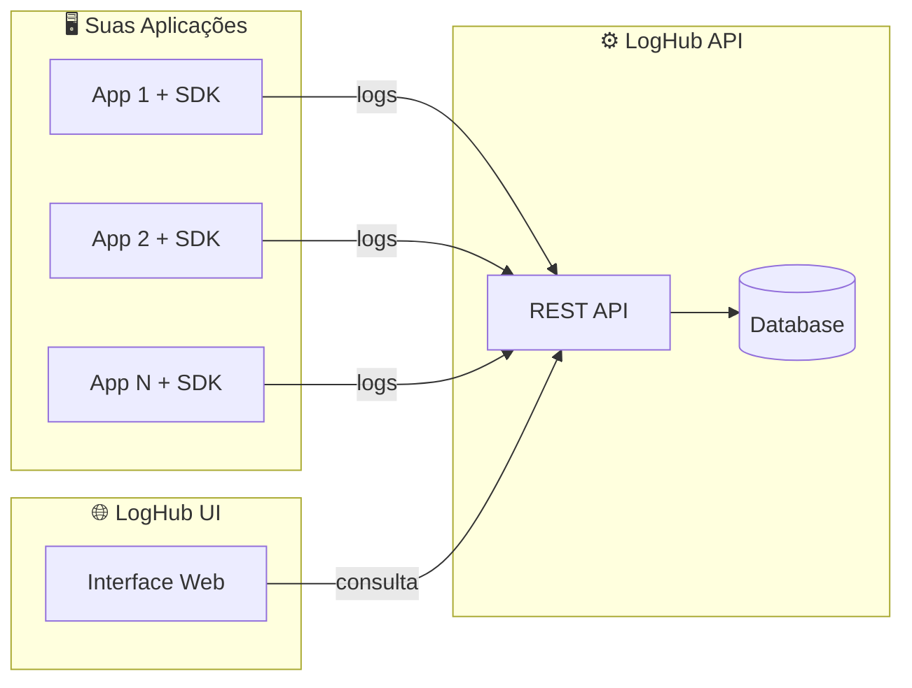

# LogHub API

API Central de Logs para ingestão e consulta de logs de aplicações internas.

## 🌐 Ecossistema LogHub

O LogHub API faz parte de um ecossistema completo para gerenciamento de logs. Conheça os outros projetos:

| Projeto | Descrição | Link |
|---------|-----------|------|
| **LogHub API** | Backend RESTful para coleta, armazenamento e consulta de logs | Este repositório |
| **LogHub SDK** | SDK para integração fácil das suas aplicações com o LogHub | [loghub-sdk](https://github.com/BrininhoBru/loghub-sdk) |
| **LogHub UI** | Interface web para visualização e diagnóstico de logs | [loghub-ui](https://github.com/BrininhoBru/loghub-ui) |

### Arquitetura



---

## 📋 Visão Geral

O **LogHub API** é um MVP para receber, persistir e consultar logs de níveis `ERROR`, `WARN`, `INFO`, `DEBUG` e `TRACE` enviados por aplicações internas via HTTP.

### Principais Funcionalidades

- ✅ Ingestão de logs via HTTP (JSON)
- ✅ Persistência em banco relacional (H2/PostgreSQL)
- ✅ Consulta de logs com filtros e paginação
- ✅ Autenticação simples via API Key

---

## 🚀 Início Rápido

### Pré-requisitos

- Java 17+
- Maven 3.8+

### Executando em Desenvolvimento

```bash
# Clone o repositório
git clone <repo-url>
cd loghub-api

# Execute a aplicação (profile dev com H2)
./mvnw spring-boot:run
```

A API estará disponível em `http://localhost:8080`

### Executando em Produção

```bash
# Configure as variáveis de ambiente
export DATABASE_URL=jdbc:postgresql://localhost:5432/loghub
export DATABASE_USERNAME=loghub
export DATABASE_PASSWORD=sua-senha
export LOGHUB_API_KEY=sua-api-key-segura

# Execute com profile de produção
./mvnw spring-boot:run -Dspring-boot.run.profiles=prod
```

---

## 🔐 Autenticação

Todas as requisições para `/api/logs` devem incluir o header:

```
X-API-KEY: sua-api-key
```

### Rotas Públicas (sem autenticação)

| Rota | Descrição |
|------|-----------|
| `/` | Informações da API |
| `/health` | Health check |
| `/h2-console/**` | Console do H2 (apenas em dev) |

### Configuração da API Key

| Ambiente | Configuração |
|----------|--------------|
| dev | `loghub-dev-key-2024` (padrão) |
| test | `test-api-key` |
| prod | Variável de ambiente `LOGHUB_API_KEY` |

### Respostas de Erro

| Código | Descrição |
|--------|-----------|
| 401 | API Key ausente ou inválida |

---

## 📡 Endpoints

### Health Check

```http
GET /health
```

Retorna o status da aplicação (não requer autenticação).

**Resposta:**
```json
{
  "status": "UP",
  "application": "loghub-api"
}
```

---

### Ingestão de Logs

```http
POST /api/logs
Content-Type: application/json
X-API-KEY: sua-api-key
```

**Request Body:**
```json
{
  "application": "minha-aplicacao",
  "environment": "production",
  "level": "ERROR",
  "message": "Erro ao processar requisição",
  "timestamp": "2024-01-15T10:30:00Z",
  "traceId": "abc-123-def",
  "metadata": {
    "userId": "user-456",
    "action": "login"
  },
  "sdk": {
    "language": "java",
    "version": "1.0.0"
  }
}
```

**Campos Obrigatórios:**
- `application` - Nome da aplicação de origem
- `environment` - Ambiente (dev, staging, production, etc.)
- `level` - Nível do log: `TRACE`, `DEBUG`, `INFO`, `WARN`, `ERROR`
- `message` - Mensagem do log
- `timestamp` - Data/hora em formato ISO-8601 UTC

**Campos Opcionais:**
- `traceId` - ID de rastreamento distribuído
- `metadata` - Objeto JSON com dados adicionais
- `sdk` - Informações do SDK que enviou o log

**Respostas:**

| Código | Descrição |
|--------|-----------|
| 201 | Log criado com sucesso |
| 400 | Payload inválido |
| 401 | API Key ausente ou inválida |

---

### Consulta de Logs

```http
GET /api/logs
X-API-KEY: sua-api-key
```

**Query Parameters (todos opcionais):**

| Parâmetro | Tipo | Descrição |
|-----------|------|-----------|
| `application` | string | Filtrar por aplicação |
| `environment` | string | Filtrar por ambiente |
| `level` | string | Filtrar por nível (TRACE, DEBUG, INFO, WARN, ERROR) |
| `from` | ISO-8601 | Data/hora inicial |
| `to` | ISO-8601 | Data/hora final |
| `page` | int | Número da página (default: 0) |
| `size` | int | Tamanho da página (default: 20) |

**Exemplo:**
```http
GET /api/logs?application=minha-app&level=ERROR&page=0&size=10
```

**Resposta:**
```json
{
  "content": [
    {
      "id": 1,
      "application": "minha-aplicacao",
      "environment": "production",
      "level": "ERROR",
      "message": "Erro ao processar requisição",
      "timestamp": "2024-01-15T10:30:00Z",
      "traceId": "abc-123-def",
      "metadata": {
        "userId": "user-456"
      },
      "sdk": {
        "language": "java",
        "version": "1.0.0"
      }
    }
  ],
  "page": 0,
  "size": 20,
  "totalElements": 1,
  "totalPages": 1
}
```

---

## 🗄️ Banco de Dados

### Configuração por Ambiente

| Profile | Banco | Descrição |
|---------|-------|-----------|
| `dev` | H2 (memória) | Console disponível em `/h2-console` |
| `test` | H2 (memória) | Para testes automatizados |
| `prod` | PostgreSQL | Produção |

### Modelo de Dados

```sql
CREATE TABLE log_events (
    id BIGSERIAL PRIMARY KEY,
    application VARCHAR(255) NOT NULL,
    environment VARCHAR(255) NOT NULL,
    level VARCHAR(50) NOT NULL,
    message TEXT NOT NULL,
    timestamp TIMESTAMP NOT NULL,
    trace_id VARCHAR(255),
    metadata TEXT,
    sdk_language VARCHAR(100),
    sdk_version VARCHAR(50)
);

-- Índices para consultas
CREATE INDEX idx_application ON log_events(application);
CREATE INDEX idx_environment ON log_events(environment);
CREATE INDEX idx_level ON log_events(level);
CREATE INDEX idx_timestamp ON log_events(timestamp);
```

---

## 🧪 Testes

```bash
# Executar todos os testes
./mvnw test

# Executar com cobertura
./mvnw test jacoco:report
```

---

## 📁 Estrutura do Projeto

```
src/main/java/io/loghub/loghub_api/
├── controller/
│   ├── LogController.java          # Endpoints de logs
│   └── HealthController.java       # Health check
├── service/
│   └── LogEventService.java        # Lógica de negócio
├── repository/
│   └── LogEventRepository.java     # Acesso a dados
├── entity/
│   └── LogEventEntity.java         # Entidade JPA
├── dto/
│   ├── LogEvent.java               # DTO de entrada
│   ├── LogEventResponse.java       # DTO de saída
│   ├── LogLevel.java               # Enum de níveis
│   ├── SdkInfo.java                # Info do SDK
│   └── PageResponse.java           # Resposta paginada
├── mapper/
│   └── LogEventMapper.java         # Conversão DTO ↔ Entity
├── filter/
│   └── ApiKeyFilter.java           # Autenticação
├── config/
│   ├── CorsConfig.java             # Configuração de CORS
│   └── GlobalExceptionHandler.java # Tratamento de erros
└── LoghubApiApplication.java       # Classe principal
```

---

## 🔧 Configurações

### application.properties

```properties
# API Key (use variável de ambiente em produção)
loghub.api.key=${LOGHUB_API_KEY:loghub-dev-key-2024}

# Profile ativo
spring.profiles.active=dev
```

### Variáveis de Ambiente (Produção)

| Variável | Descrição | Obrigatória |
|----------|-----------|-------------|
| `LOGHUB_API_KEY` | API Key para autenticação | ✅ |
| `DATABASE_URL` | URL do PostgreSQL | ✅ |
| `DATABASE_USERNAME` | Usuário do banco | ✅ |
| `DATABASE_PASSWORD` | Senha do banco | ✅ |

---

## 🌐 Configuração de CORS

A API possui configuração de CORS para permitir requisições de aplicações frontend.

### Arquivo de Configuração

O arquivo `src/main/java/io/loghub/loghub_api/config/CorsConfig.java` define as origens permitidas.

### Origens Permitidas (Padrão)

```java
config.setAllowedOrigins(Arrays.asList(
    "http://localhost:5173",  // Vite dev server
    "http://localhost:3000",  // Create React App
    "http://127.0.0.1:5173",
    "http://127.0.0.1:3000"
));
```

### ⚠️ Importante: Configuração em Produção

**Para ambientes de produção, você DEVE alterar o `CorsConfig.java`** para incluir apenas as origens do seu frontend:

```java
config.setAllowedOrigins(Arrays.asList(
    "https://seu-frontend.com",
    "https://www.seu-frontend.com"
));
```

> **Nunca use `"*"` (todas as origens) em produção com `allowCredentials=true`**, pois isso é uma vulnerabilidade de segurança.

---

## 📦 Build

```bash
# Gerar JAR executável
./mvnw clean package -DskipTests

# O JAR estará em target/loghub-api-0.0.1-SNAPSHOT.jar

# Executar o JAR
java -jar target/loghub-api-0.0.1-SNAPSHOT.jar --spring.profiles.active=prod
```

---

## 🐳 Docker (Opcional)

```dockerfile
FROM eclipse-temurin:17-jre-alpine
WORKDIR /app
COPY target/loghub-api-0.0.1-SNAPSHOT.jar app.jar
EXPOSE 8080
ENTRYPOINT ["java", "-jar", "app.jar"]
```

```bash
# Build da imagem
docker build -t loghub-api .

# Executar
docker run -p 8080:8080 \
  -e LOGHUB_API_KEY=sua-key \
  -e DATABASE_URL=jdbc:postgresql://host:5432/loghub \
  -e DATABASE_USERNAME=loghub \
  -e DATABASE_PASSWORD=senha \
  -e SPRING_PROFILES_ACTIVE=prod \
  loghub-api
```

---

## 📝 Licença

Este projeto está licenciado sob a [MIT License](LICENSE).

---

## 👥 Contribuição

1. Crie uma branch para sua feature (`git checkout -b feature/nova-feature`)
2. Commit suas mudanças seguindo o padrão **Conventional Commits** (veja abaixo)
3. Push para a branch (`git push origin feature/nova-feature`)
4. Abra um Pull Request

### 📐 Padrão de Commits — Conventional Commits

Este projeto adota o padrão [Conventional Commits](https://www.conventionalcommits.org/pt-br/) para todas as mensagens de commit. Isso garante um histórico legível e permite a geração automática de changelogs.

#### Formato

```
<tipo>(escopo opcional): <descrição curta>

[corpo opcional]

[rodapé(s) opcional(is)]
```

#### Tipos Permitidos

| Tipo | Quando usar |
|------|-------------|
| `feat` | Nova funcionalidade |
| `fix` | Correção de bug |
| `docs` | Alterações apenas na documentação |
| `style` | Formatação, ponto-e-vírgula, espaços — sem mudança de lógica |
| `refactor` | Refatoração de código sem adição de feature ou correção de bug |
| `test` | Adição ou correção de testes |
| `chore` | Atualizações de build, dependências ou configurações |
| `perf` | Melhoria de performance |
| `ci` | Alterações em arquivos de CI/CD |
| `revert` | Reversão de um commit anterior |

#### Exemplos

```bash
# Nova funcionalidade
git commit -m "feat(logs): add filter by traceId on GET /api/logs"

# Correção de bug
git commit -m "fix(auth): return 401 when API key header is empty"

# Documentação
git commit -m "docs: add Conventional Commits standard to contribution guide"

# Refatoração
git commit -m "refactor(service): extract log validation to separate method"

# Breaking change (indicada com '!' ou no rodapé)
git commit -m "feat(api)!: change log level field to uppercase only"
```

> 💡 **Dica:** Mensagens em **inglês** são preferidas para manter consistência com o ecossistema de ferramentas e facilitar a colaboração.
