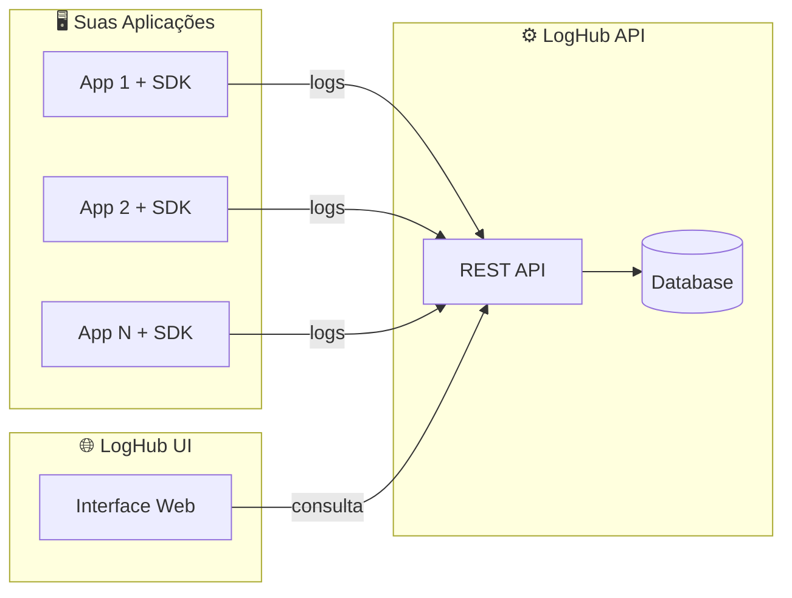

<div align="center">

# ⚙️ LogHub API

**Backend RESTful para ingestão, armazenamento e consulta de logs**

[](https://openjdk.org/)
[](https://spring.io/projects/spring-boot)
[](https://maven.apache.org/)
[](LICENSE)
[](https://github.com/LogHub-Open/.github/blob/main/CONTRIBUTING.md)

[Sobre](#-sobre) •
[Instalação](#-instalação) •
[Endpoints](#-endpoints) •
[Contribuindo](#-contribuindo) •
[Licença](#-licença)

</div>

---

## 📋 Sumário

- [Sobre](#-sobre)
- [Funcionalidades](#-funcionalidades)
- [Instalação](#-instalação)
- [Autenticação](#-autenticação)
- [Endpoints](#-endpoints)
- [Banco de Dados](#️-banco-de-dados)
- [Estrutura do Projeto](#-estrutura-do-projeto)
- [Configuração](#-configuração)
- [CORS](#-cors)
- [Testes](#-testes)
- [Build](#️-build)
- [Docker](#-docker)
- [Ecossistema LogHub](#-ecossistema-loghub)
- [Contribuindo](#-contribuindo)
- [Licença](#-licença)

## ✨ Sobre

O **LogHub API** é o backend central de logs do ecossistema LogHub: recebe, persiste e disponibiliza para consulta logs dos níveis `ERROR`, `WARN`, `INFO`, `DEBUG` e `TRACE` enviados por aplicações internas via HTTP, tipicamente através do [loghub-sdk](https://github.com/LogHub-Open/loghub-sdk).

## 🌟 Funcionalidades

- ✅ Ingestão de logs via HTTP (JSON)
- ✅ Persistência em banco relacional (H2 em dev/test, PostgreSQL em produção)
- ✅ Consulta de logs com filtros e paginação
- ✅ Autenticação simples via API Key

## 📦 Instalação

### Pré-requisitos

- Java 17+
- Maven 3.8+

### Desenvolvimento (profile `dev`, banco H2)

```bash
git clone https://github.com/LogHub-Open/loghub-api.git
cd loghub-api
./mvnw spring-boot:run
```

A API estará disponível em `http://localhost:8080`.

### Produção (profile `prod`, PostgreSQL)

```bash
export DATABASE_URL=jdbc:postgresql://localhost:5432/loghub
export DATABASE_USERNAME=loghub
export DATABASE_PASSWORD=sua-senha
export LOGHUB_API_KEY=sua-api-key-segura

./mvnw spring-boot:run -Dspring-boot.run.profiles=prod
```

## 🔐 Autenticação

Todas as requisições para `/api/logs` devem incluir o header:

```
X-API-KEY: sua-api-key
```

### Rotas públicas (sem autenticação)

| Rota | Descrição |
|------|-----------|
| `/` | Informações da API |
| `/health` | Health check |
| `/h2-console/**` | Console do H2 (apenas em dev) |

### Configuração por ambiente

| Ambiente | Configuração |
|----------|--------------|
| `dev` | `loghub-dev-key-2024` (padrão) |
| `test` | `test-api-key` |
| `prod` | Variável de ambiente `LOGHUB_API_KEY` |

| Código | Descrição |
|--------|-----------|
| `401` | API Key ausente ou inválida |

## 📡 Endpoints

### Health Check

```http
GET /health
```

**Resposta:**
```json
{
  "status": "UP",
  "application": "loghub-api"
}
```

---

### Ingestão de Logs

```http
POST /api/logs
Content-Type: application/json
X-API-KEY: sua-api-key
```

**Request Body**
```json
{
  "application": "minha-aplicacao",
  "environment": "production",
  "level": "ERROR",
  "message": "Erro ao processar requisição",
  "timestamp": "2024-01-15T10:30:00Z",
  "traceId": "abc-123-def",
  "metadata": {
    "userId": "user-456",
    "action": "login"
  },
  "sdk": {
    "language": "java",
    "version": "1.0.0"
  }
}
```

**Campos obrigatórios:** `application`, `environment`, `level` (`TRACE`/`DEBUG`/`INFO`/`WARN`/`ERROR`), `message`, `timestamp` (ISO-8601 UTC)
**Campos opcionais:** `traceId`, `metadata`, `sdk`

**Respostas**

| Código | Descrição |
|--------|-----------|
| `201` | Log criado com sucesso |
| `400` | Payload inválido |
| `401` | API Key ausente ou inválida |

---

### Consulta de Logs

```http
GET /api/logs
X-API-KEY: sua-api-key
```

**Query Parameters** (todos opcionais)

| Parâmetro | Tipo | Descrição |
|-----------|------|-----------|
| `application` | string | Filtrar por aplicação |
| `environment` | string | Filtrar por ambiente |
| `level` | string | Filtrar por nível |
| `from` | ISO-8601 | Data/hora inicial |
| `to` | ISO-8601 | Data/hora final |
| `page` | int | Número da página (padrão: 0) |
| `size` | int | Tamanho da página (padrão: 20) |

**Exemplo**
```http
GET /api/logs?application=minha-app&level=ERROR&page=0&size=10
```

**Resposta**
```json
{
  "content": [
    {
      "id": 1,
      "application": "minha-aplicacao",
      "environment": "production",
      "level": "ERROR",
      "message": "Erro ao processar requisição",
      "timestamp": "2024-01-15T10:30:00Z",
      "traceId": "abc-123-def",
      "metadata": { "userId": "user-456" },
      "sdk": { "language": "java", "version": "1.0.0" }
    }
  ],
  "page": 0,
  "size": 20,
  "totalElements": 1,
  "totalPages": 1
}
```

## 🗄️ Banco de Dados

| Profile | Banco | Descrição |
|---------|-------|-----------|
| `dev` | H2 (memória) | Console disponível em `/h2-console` |
| `test` | H2 (memória) | Para testes automatizados |
| `prod` | PostgreSQL | Produção |

**Modelo de dados:**
```sql
CREATE TABLE log_events (
    id BIGSERIAL PRIMARY KEY,
    application VARCHAR(255) NOT NULL,
    environment VARCHAR(255) NOT NULL,
    level VARCHAR(50) NOT NULL,
    message TEXT NOT NULL,
    timestamp TIMESTAMP NOT NULL,
    trace_id VARCHAR(255),
    metadata TEXT,
    sdk_language VARCHAR(100),
    sdk_version VARCHAR(50)
);

CREATE INDEX idx_application ON log_events(application);
CREATE INDEX idx_environment ON log_events(environment);
CREATE INDEX idx_level ON log_events(level);
CREATE INDEX idx_timestamp ON log_events(timestamp);
```

## 📁 Estrutura do Projeto

```
src/main/java/io/loghub/loghub_api/
├── controller/
│   ├── LogController.java          # Endpoints de logs
│   └── HealthController.java       # Health check
├── service/
│   └── LogEventService.java        # Lógica de negócio
├── repository/
│   └── LogEventRepository.java     # Acesso a dados
├── entity/
│   └── LogEventEntity.java         # Entidade JPA
├── dto/
│   ├── LogEvent.java                # DTO de entrada
│   ├── LogEventResponse.java        # DTO de saída
│   ├── LogLevel.java                # Enum de níveis
│   ├── SdkInfo.java                 # Info do SDK
│   └── PageResponse.java            # Resposta paginada
├── mapper/
│   └── LogEventMapper.java          # Conversão DTO ↔ Entity
├── filter/
│   └── ApiKeyFilter.java            # Autenticação
├── config/
│   ├── CorsConfig.java              # Configuração de CORS
│   └── GlobalExceptionHandler.java  # Tratamento de erros
└── LoghubApiApplication.java        # Classe principal
```

## 🔧 Configuração

**`application.properties`**
```properties
loghub.api.key=${LOGHUB_API_KEY:loghub-dev-key-2024}
spring.profiles.active=dev
```

**Variáveis de ambiente (produção)**

| Variável | Descrição | Obrigatória |
|----------|-----------|-------------|
| `LOGHUB_API_KEY` | API Key para autenticação | ✅ |
| `DATABASE_URL` | URL do PostgreSQL | ✅ |
| `DATABASE_USERNAME` | Usuário do banco | ✅ |
| `DATABASE_PASSWORD` | Senha do banco | ✅ |

## 🌐 CORS

Origens permitidas por padrão, definidas em `config/CorsConfig.java`:

```java
config.setAllowedOrigins(Arrays.asList(
    "http://localhost:5173",  // Vite dev server
    "http://localhost:3000",  // Create React App
    "http://127.0.0.1:5173",
    "http://127.0.0.1:3000"
));
```

> ⚠️ **Em produção**, altere `CorsConfig.java` para incluir apenas as origens do seu frontend. Nunca use `"*"` em produção com `allowCredentials=true` — é uma vulnerabilidade de segurança.

## 🧪 Testes

```bash
./mvnw test                    # Executar todos os testes
./mvnw test jacoco:report      # Executar com cobertura
```

## 🏗️ Build

```bash
./mvnw clean package -DskipTests
java -jar target/loghub-api-0.0.1-SNAPSHOT.jar --spring.profiles.active=prod
```

## 🐳 Docker

```dockerfile
FROM eclipse-temurin:17-jre-alpine
WORKDIR /app
COPY target/loghub-api-0.0.1-SNAPSHOT.jar app.jar
EXPOSE 8080
ENTRYPOINT ["java", "-jar", "app.jar"]
```

```bash
docker build -t loghub-api .

docker run -p 8080:8080 \
  -e LOGHUB_API_KEY=sua-key \
  -e DATABASE_URL=jdbc:postgresql://host:5432/loghub \
  -e DATABASE_USERNAME=loghub \
  -e DATABASE_PASSWORD=senha \
  -e SPRING_PROFILES_ACTIVE=prod \
  loghub-api
```

## 🌐 Ecossistema LogHub

O LogHub API faz parte de um ecossistema completo para gerenciamento de logs:

| Projeto | Descrição | Link |
|---------|-----------|------|
| **LogHub API** | Backend RESTful para coleta, armazenamento e consulta de logs | Este repositório |
| **LogHub SDK** | SDK para integração das aplicações com o LogHub | [loghub-sdk](https://github.com/LogHub-Open/loghub-sdk) |
| **LogHub UI** | Interface web para visualização e diagnóstico de logs | [loghub-ui](https://github.com/LogHub-Open/loghub-ui) |



**Como funciona:** suas aplicações usam o **SDK** para enviar logs estruturados via HTTP para a **API**, que os armazena e indexa; você visualiza e analisa os dados através da **UI**.

## 🤝 Contribuindo

Este projeto segue as diretrizes gerais da organização:

- 📖 [Guia de Contribuição](https://github.com/LogHub-Open/.github/blob/main/CONTRIBUTING.md) — como abrir fork, branch e Pull Request, e como reportar bugs ou sugerir melhorias
- 🤝 [Código de Conduta](https://github.com/LogHub-Open/.github/blob/main/CODE_OF_CONDUCT.md)
- 🔒 [Política de Segurança](https://github.com/LogHub-Open/.github/blob/main/SECURITY.md) — para reportar vulnerabilidades

Padrão rápido de commit ([Conventional Commits](https://www.conventionalcommits.org/pt-br/)):

```bash
git commit -m "feat(logs): add filter by traceId on GET /api/logs"
git commit -m "fix(auth): return 401 when API key header is empty"
```

Além dos tipos padrão (`feat`, `fix`, `docs`, `chore`), este projeto também usa `style`, `refactor`, `test`, `perf`, `ci` e `revert` para descrever mudanças com mais precisão.

> 💡 Mensagens de commit em **inglês** são preferidas para manter consistência com o ecossistema de ferramentas.

## 📝 Licença

Este projeto está licenciado sob a [MIT License](LICENSE).

---

<div align="center">

⭐ Se este projeto te ajudou, considere dar uma estrela!

</div>
